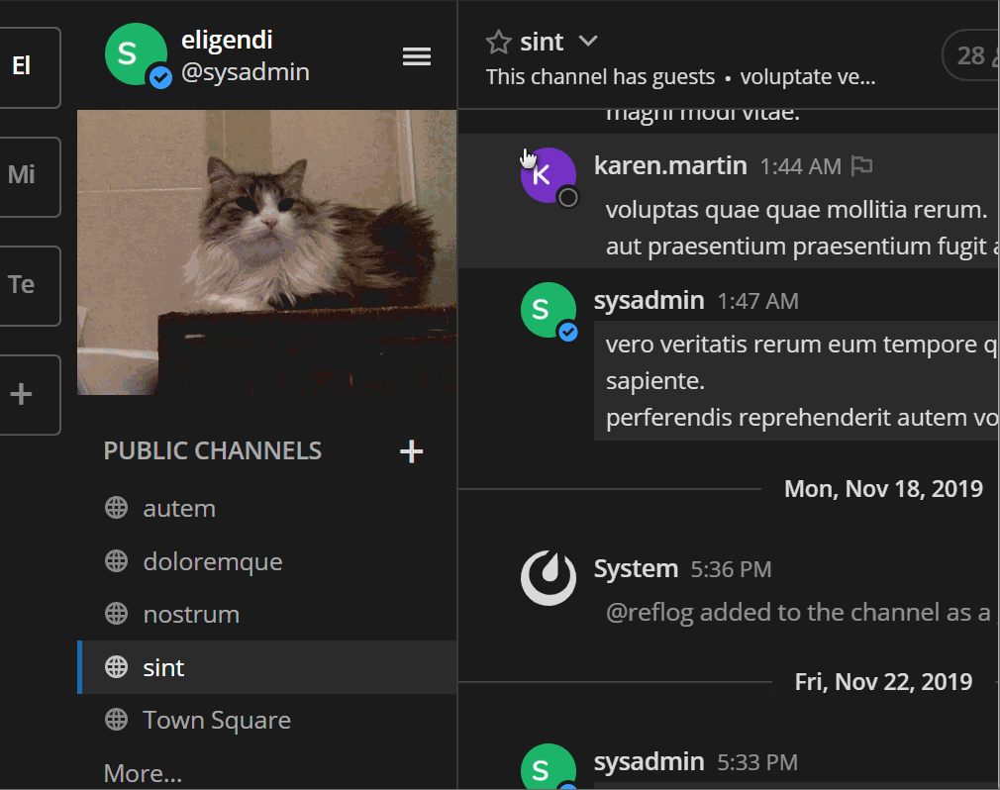

# Creepy 👺
This plugin makes a creepy face that's following your cursor while you chat.

Created as part of [Mattermost Hackathon 2019](https://github.com/mattermost/mattermost-hackathon-nov2019#how-do-i-submit-my-project)

## Install
Simply upload the plugin bundle [from the releases page](https://github.com/reflog/mattermost-plugin-creepy/releases) to your Mattermost server and configure the fields on the settings page.

## Usage

Move your mouse around. Enjoy the creepy picture following you. Click the picture to change the creeper.
